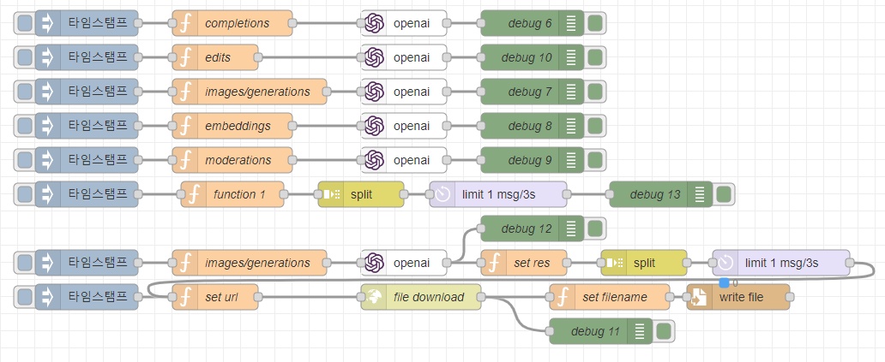

node-red-contrib-openai
================

Node-RED node for openai


## Install

To install the stable version use the `Menu - Manage palette - Install`
option and search for node-red-contrib-openai, or run the following
command in your Node-RED user directory, typically `~/.node-red`

    npm install node-red-contrib-openai

## Wrapper openai  API  
- https://platform.openai.com/docs/api-reference/introduction

## Sample parameters
```js
msg.api = 'chat/completions';
msg.params = {
    "model": "gpt-3.5-turbo",
    "messages": [
        {
            "role": "system",
            "content": "You are a helpful assistant."
        },
        {
            "role": "user",
            "content": "Hello!"
        }
    ],
    "max_tokens": 7,
    "temperature": 0
}
return msg;
```

## Sample Flow
You can make this json string into a flow by using the node-red flow import function.

- [sample.json](examples/sample.json)





